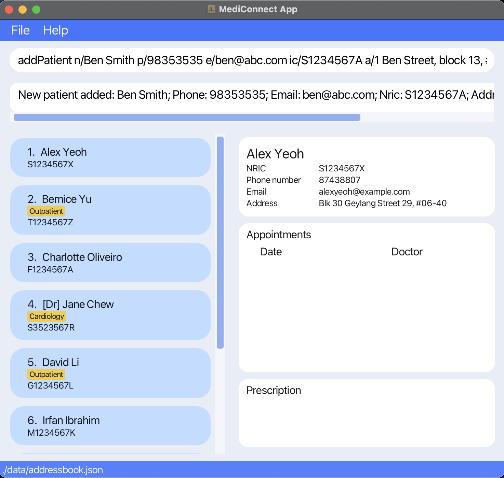
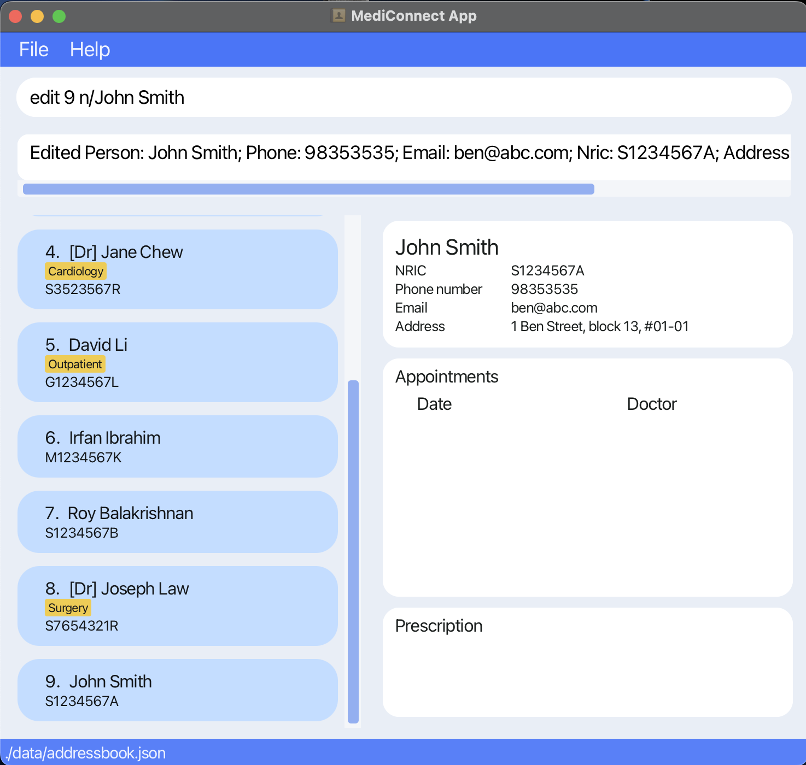
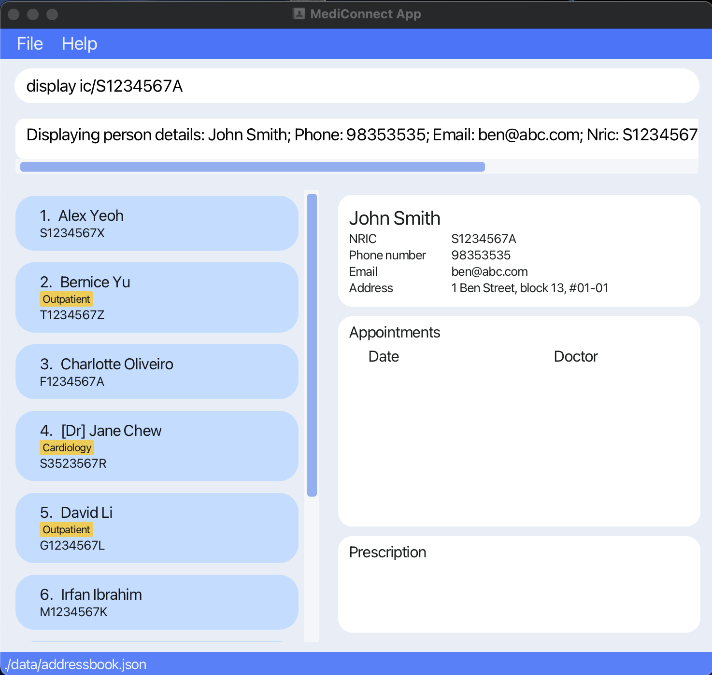
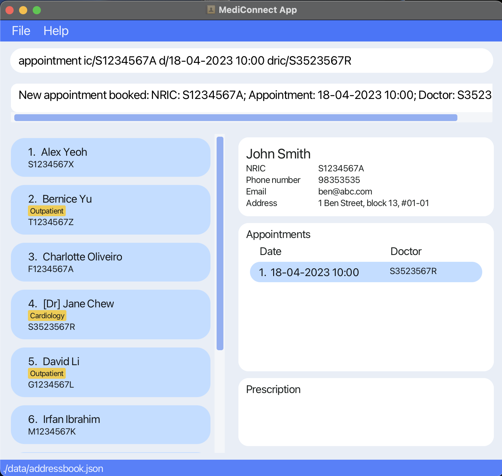
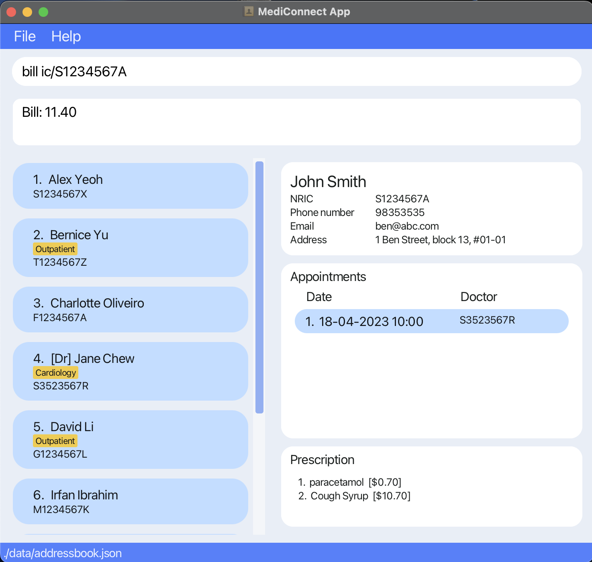

Introducing **MediConnect** - the hospital management application designed to  **streamline patient management, 
doctor coordination, and hospital billing.** As a centralised platform, **MediConnect** offers healthcare 
professionals and administrative staff an efficient solution to manage administrative matters in local clinics. 
The app simplifies the organization and maintenance of patient and doctor data, appointments and billing records.  
**MediConnect** can be used with either a command line interface (CLI) or a graphical user interface (GUI).
Users experienced with the CLI may get their tasks done faster than traditional GUI apps.  

_With MediConnect, managing your healthcare practice has never been easier._

* Table of Contents
{:toc}

--------------------------------------------------------------------------------------------------------------------

## Quick start

1. Ensure you have Java `11` or above installed in your Computer.
   * If you are unsure of your system's Java version, you may use [this guide](https://www.java.com/en/download/help/version_manual.html) to find out.

2. Download the latest `MediConnect.jar` from [here](https://github.com/AY2223S2-CS2103T-W13-1/tp/releases).

3. Copy the file to the folder you want to use as the _home folder_ for your MediConnect.

4. Double-click the file to start the app. 
   A GUI similar to the below should appear in a few seconds. Note how the app contains some sample data. 
   

5. Type the command in the command box and press Enter to execute it. e.g. typing **`help`** and pressing Enter will open the help window. 
   Some example commands you can try:

   * `list` : Lists all stored patients and doctors.

   * `addPatient n/Ben Smith p/98353535 e/ben@abc.com ic/S1234567A a/Ben Street, block 13, #01-01` : Adds a patient named `Ben Smith` to MediConnect.

   * `delete ic/S1234567A` : Deletes the person with NRIC `S1234567A` from the current list.

   * `clear` : Deletes all persons stored in the application.

   * `exit` : Exits the app.

6. Refer to the [Features](#features) below for details of each command.

--------------------------------------------------------------------------------------------------------------------

## Features

**:information_source: Notes about the command format:** 

* Words in `UPPER_CASE` are the parameters to be supplied by the user. 
  e.g. in `add n/NAME`, `NAME` is a parameter which can be used as `add n/John Doe`.

* Items in square brackets are optional. 
  e.g `n/NAME [t/TAG]` can be used as `n/John Doe t/friend` or as `n/John Doe`.

* Items with `…`​ after them can be used multiple times including zero times. 
  e.g. `[t/TAG]…​` can be used as ` ` (i.e. 0 times), `t/friend`, `t/friend t/family` etc.

* Parameters can be in any order. 
  e.g. if the command specifies `n/NAME p/PHONE_NUMBER`, `p/PHONE_NUMBER n/NAME` is also acceptable.

* If a parameter is expected only once in the command, but it's specified multiple times, only the last occurrence of the parameter will be taken. 
  e.g. if the command specifies `p/12341234 p/56785678`, only `p/56785678` will be stored.

* Parameters for commands that do not take in parameters (such as `help`, `list`, `exit` and `clear`) will be ignored. 
  e.g. if the command specifies `help 123`, it will be interpreted as `help`.

| Field            | Prefix | Input Restrictions                                                                                                                                                                                                                                                                                                                                                                                                                                                                                                                                                                                                   |
|------------------|--------|----------------------------------------------------------------------------------------------------------------------------------------------------------------------------------------------------------------------------------------------------------------------------------------------------------------------------------------------------------------------------------------------------------------------------------------------------------------------------------------------------------------------------------------------------------------------------------------------------------------------|
| **Address**      | a/     |                                                                                                                                                                                                                                                                                                                                                                                                                                                                                                                                                                                                                      |
| **Date**         | d/     | 1. Format should be DD-MM-YYYY HH:mm, e.g., 31-03-2023 14:00.   2. 'DD' must be between 01-31 and 'MM' between 01-12.   3. HH:mm should follow the 24-hour notation"                                                                                                                                                                                                                                                                                                                                                                                                                                           |
| **Email**        | e/     | 1. Should be of the format local-part@domain   2. The local-part should only contain alphanumeric characters and these special characters (+_.-). The local-part may not start or end with any special characters.   3. This is followed by a '@' and then a domain name. The domain name is made up of domain labels separated by periods.   The domain name must:   - end with a domain label at least 2 characters long   - have each domain label start and end with alphanumeric characters   - have each domain label consist of alphanumeric characters, separated only by hyphens, if any. |
| **Medication**   | m/     |                                                                                                                                                                                                                                                                                                                                                                                                                                                                                                                                                                                                                      |
| **Name**         | n/     | Should only contain alphanumeric characters and spaces.                                                                                                                                                                                                                                                                                                                                                                                                                                                                                                                                                              |
| **NRIC**         | ic/    | 1. Should be 9 characters long.   2. The first character must be one of [S,T,F,G,M], followed by 7 numerical digits and ending with [A-Z].                                                                                                                                                                                                                                                                                                                                                                                                                                                                        |
| **Phone Number** | p/     | 1. Should only contain numbers.   2. Should be at least 3 digits long.                                                                                                                                                                                                                                                                                                                                                                                                                                                                                                                                            |
| **Tag**          | t/     | Should be alphanumeric.                                                                                                                                                                                                                                                                                                                                                                                                                                                                                                                                                                                              |

### Adding a person: `add a patient`, `add a doctor`

Adds a person (patient/doctor) to MediConnect.

Format: `addPatient n/NAME p/PHONE_NUMBER e/EMAIL ic/NRIC a/ADDRESS [t/TAG]`   
&nbsp;&nbsp;&nbsp;&nbsp;&nbsp;&nbsp;&nbsp;&nbsp;&nbsp;&nbsp;&nbsp;&nbsp;&nbsp;&nbsp;`addDoctor n/NAME p/PHONE_NUMBER e/EMAIL ic/NRIC a/ADDRESS [t/TAG]`

* Adds the specified person to MediConnect.
* Each person can be added only once.
* Each person's NRIC must be distinct.

Examples:
* `addPatient n/Ben Smith p/98353535 e/ben@abc.com ic/S1234567A a/1 Ben Street, block 13, #01-01` adds the patient `Ben Smith` to the list.
* `addDoctor n/Sarah Tan p/99123456 e/sarah@abc.com ic/T7654321P a/Sarah Rd t/Pediatrician` adds the doctor `Sarah Tan` to the list.

### Deleting a person by NRIC : `delete`

Deletes the specified person from MediConnect.

Format: `delete ic/NRIC`

* Deletes the person with the specified `NRIC`

Examples:
* `delete ic/S9876543K` deletes the person with the NRIC number S9876543K in MediConnect.

### Editing a person : `edit`

Edits the details of an existing person stored in MediConnect.

Format `edit INDEX [n/NAME] [p/PHONE] [e/EMAIL] [ic/NRIC] [a/ADDRESS] [t/TAG]…​`

* Edits the person at the specified INDEX. The index refers to the index number shown in the displayed person list. The *index must be a positive integer* 1, 2, 3, …​
* At least one of the optional fields must be provided.
* Existing values will be updated to the input values.
* When editing tags, the existing tags of the person will be removed i.e adding of tags is not cumulative.
* Tags can be removed by typing t/ without specifying any tags after it.

Examples:
* `edit 9 n/John Smith` will edit the name of the 9th person listed to "Jon Smith".

### Display patient's information : `display`
Displays personal particulars, appointments and prescription for patients.

Format: `display ic/NRIC`

* Displays personal particulars, appointments and prescription for the patient with the specified `NRIC`.

Examples:
* `display ic/S1234567A` displays the information for the patient with NRIC number S1234567A.

### Finding a person (patient or doctor) by NRIC : `find`

Finds and displays information about the specified person.

Format: `find ic/NRIC`

* Finds the person with the specified `NRIC`
* Search is case-insensitive. e.g `s1234567a` will match with `S1234567A`.
* Only the NRIC is searched, additional input (e.g. n/NAME) will be ignored.
* Only full NRIC entries can be searched.

Examples:
* `find ic/S1234567A` returns the details for the person with NRIC number S1234567A.

### Book appointment : `appointment`

Schedules an appointment with a specific doctor for the specified person.
Note that this updates the appointment list for the specified patient, and the specified doctor in the detailed person view when 'display' command is used.

Format: `appointment ic/NRIC d/DATE dric/NRIC`

* Schedules an appointment on the given `DATE` for the patient with `ic/NRIC` with the doctor with `dric/NRIC`

Examples:
* `appointment ic/S1234567A d/01-04-2023 10:00 dric/S7654321Z` schedules an appointment on 01-04-2023 10:00, for patient with NRIC number S1234567A, with doctor with NRIC number S7654321Z. 

### Delete appointment : `deleteAppointment`

Deletes an appointment specified by the index of the patient’s appointment list.
Note that this command can only be used on patients (ie. you can only delete an appointment from the patient's end, and not from the doctor's end).
Similarly, this updates the appointment list for the specified patient, and the specified doctor in the detailed person view when 'display' command is used.

Format: `deleteAppointment INDEX ic/NRIC`

* Deletes the appointment indicated by `INDEX` from the list of appointments for the person specified by `NRIC`.
* `INDEX` refers to the index number shown in the displayed appointment list for the person. The *index must be a positive integer* 1, 2, 3, …​

Examples:
* `deleteAppointment 2 ic/S1234567A` deletes the 2nd appointment as displayed the list for person with NRIC number S1234567A.

### Prescribing patient’s medication : `prescribe`

Prescribes medication to a patient, noting the medication's name and cost.

Format: `prescribe ic/NRIC m/MEDICATION c/COST`

Examples:
*  `prescribe m/paracetamol ic/S1234567X c/10` Prescribes paracetamol the patient of IC S1234567X at a cost of $10
*  `prescribe m/Cough Syrup ic/S1234567X c/0.1` Prescribes cough syrup to the patient of IC S1234567X at a cost of $0.10

### Removing patient’s medication : `unprescribe`

Removes a chosen medication from a patient.

Format: `unprescribe ic/NRIC m/MEDICATION`

Examples:
*  `unprescribe ic/S1234567X m/paracetamol` Remove patient of IC S1234567X's paracetamol prescription
*  `unprescribe m/Cough Syrup ic/S1234567X` Remove patient of IC S1234567X's cough syrup prescription

### Bill : `bill`

Calculates the cost of all medication given a Patient's prescription.

Format: `bill ic/NRIC`

Examples:
* `bill ic/S1234567X` Calculates the cost of patient's (of IC S1234567X) medication.

### Retrieve persons information : `list`

Shows a list of all persons in MediConnect.

Format: `list`

### Retrieve doctors information : `listDoctors`

Shows a list of all doctors in MediConnect.

Format: `listDoctors`

### Retrieve patients information : `listPatients`

Shows a list of all patients in MediConnect.

Format: `listPatients`

### Clearing all entries : `clear`

Deletes all patients' and doctors' data from the system.

Format: `clear`

* Data cannot be retrieved after `clear` is performed.

Example:
* `clear` permanently deletes all data stored in the system.

### Requesting help : `help`

Provides the user with a link to this user guide.

Format: `help`

Examples:
* `help` opens a mini window with a url link of this user guide which can be copied by the user.

### Exiting the program : `exit`

Closes the `MediConnect` application.

Format: `exit`

Examples:
* `exit` closes the `MediConnect` application immediately.

### Sending automated messages to patients `[coming in v2.0]`

_Details coming soon ..._

--------------------------------------------------------------------------------------------------------------------

## FAQ

**1. What can I do if MediConnect.jar does not open when double-clicked?**  
Open a command terminal, `cd` into the folder you put the jar file in, and use the `java -jar MediConnect.jar` command to run the application.

**2. Do I need to manually store the data?**  
No, MediConnect data is saved on the hard disk automatically after any command that changes the data. There is no need to save manually.

--------------------------------------------------------------------------------------------------------------------

## Command summary 

| Action                 | Format, Examples                                                                                                                                                                                                                                                                                                                                          |
|------------------------|-----------------------------------------------------------------------------------------------------------------------------------------------------------------------------------------------------------------------------------------------------------------------------------------------------------------------------------------------------------|
| **Add Person**         | 1. `addPatient n/NAME p/PHONE_NUMBER e/EMAIL ic/NRIC a/ADDRESS [t/TAG]…​`   e.g., `addPatient n/Ben Smith p/98353535 e/ben@abc.com ic/S1234567A a/1 Ben Street, block 13, #01-01`   2. `addDoctor n/NAME p/PHONE_NUMBER e/EMAIL ic/NRIC a/ADDRESS [t/TAG]…​`   e.g., `addDoctor n/Sarah Tan p/99123456 e/sarah@abc.com ic/T7654321P a/Sarah Rd`  |
| **Bill**               | `bill ic/NRIC`   e.g.,                               cost ic/S1234567X                                                                                                                                                                                                                                                                                 |
| **Book Appointment**   | `appointment ic/NRIC d/DATE dric/NRIC`   e.g., `appointment ic/S1234567A d/01-04-2023 10:00 dric/S7654321Z`                                                                                                                                                                                                                                            |
| **Clear**              | `clear`                                                                                                                                                                                                                                                                                                                                                   |
| **Delete Appointment** | `deleteAppointment INDEX ic/NRIC`   e.g., `deleteAppointment 2 ic/S1234567A`                                                                                                                                                                                                                                                                           |
| **Delete Person**      | `delete ic/NRIC`  e.g., `delete ic/S1234567A`                                                                                                                                                                                                                                                                                                          |
| **Display**            | `display ic/NRIC`   e.g., `display ic/S1234567A`                                                                                                                                                                                                                                                                                                       |
| **Edit**               | `edit INDEX [n/NAME] [p/PHONE_NUMBER] [e/EMAIL] [ic/NRIC] [a/ADDRESS] [t/TAG]…​`   e.g., `edit 2 n/James Lee e/jameslee@example.com`                                                                                                                                                                                                                   |
| **Exit**               | `exit`                                                                                                                                                                                                                                                                                                                                                    |
| **Find**               | `find ic/NRIC`  e.g., `find ic/S1234567A`                                                                                                                                                                                                                                                                                                              |
| **Help**               | `help`                                                                                                                                                                                                                                                                                                                                                    |
| **List**               | `list`   `listDoctors`   `listPatients`                                                                                                                                                                                                                                                                                                             |
| **Prescribe**          | `prescribe medication to patient`                                                                                                                                                                                                                                                                                                                         |
| **Unprescribe**        | `unprescribe ic/NRIC m/MEDICATION`   e.g., unprescribe m/paracetamol ic/S1234567X                                                                                                                                                                                                                                                                      |
